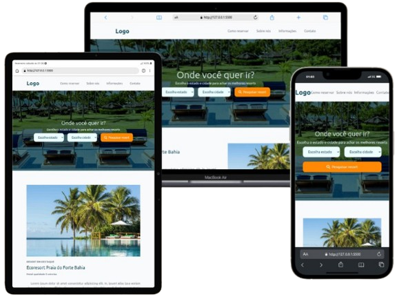

# Capacitação da Compact jr | Tailwind

### Imagem do Projeto

   

### Sobre

    Este repositório contém o código-fonte do meu primeiro projeto pessoal utilizando tailwind, no qual foi desenvolvido dentro da capacitação de iniciantes na empresa Compact jr. Trata-se da página home de um site para um hotel fictício. O sistema demonstra minha abordagem ao desenvolvimento web, focando em design responsivo.

### Tecnologias Utilizadas

    O site foi construído utilizando uma variedade de tecnologias e ferramentas modernas:

- **HTML & TailwindCSS**: Estruturação e estilização responsiva do site.
- **FontAwesome**: Ícones estilizados e de fácil implementação.
- **Git**: Utilizado no versionamento de todo projeto.

Devido a nova atualização do tailwind no início de 2025 durante o desenvolvimento é necessário codar com o comando a seguir rodando em segundo plano  no terminal do repositório

    npx @tailwindcss/cli -i ./src/input.css -o ./src/output.css --watch

### Links

    <strong>Site : </strong>
    <a href="capacitacao-tailwind.vercel.app" target="_blank" rel="external">Capacitação Tailwind</a>

   <strong>Linkedin : </strong>
   <a href="https://www.linkedin.com/in/dionatan-eduardo-correa-rodrigues-76b507255/" target="_blank" rel="external">Dionatan Rodrigues</a>
 

Obrigado por visitar o repositório do meu projeto!

